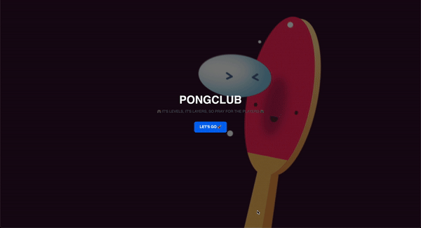
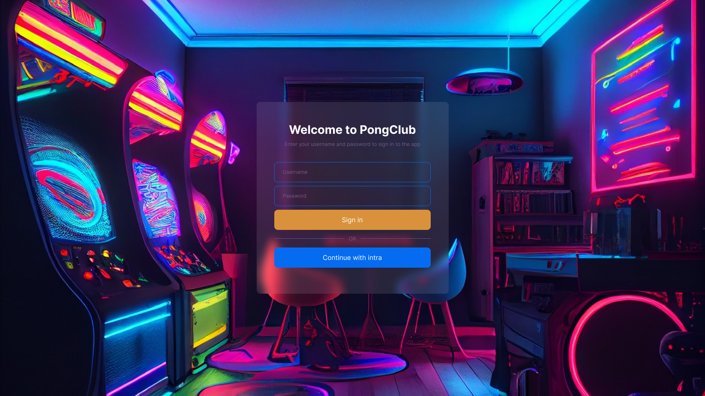
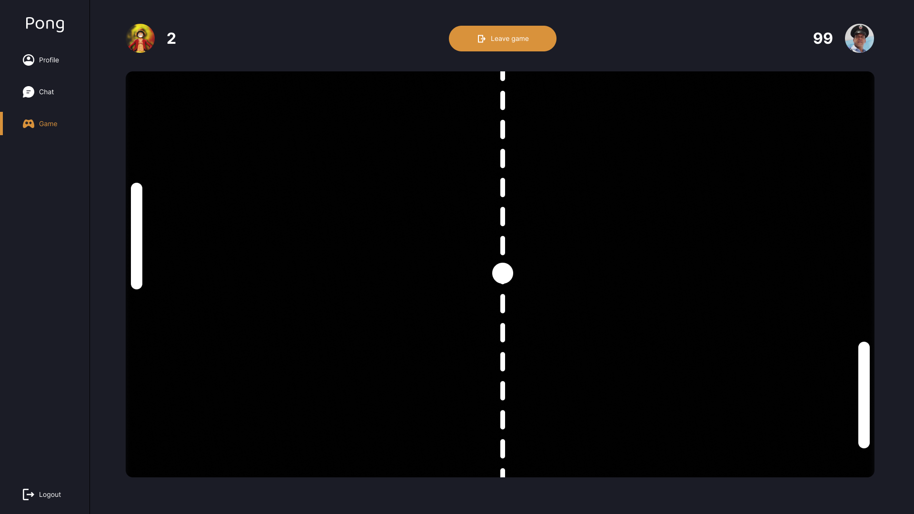

# PONG CLUB
IT'S LEVELS IT'S LAYERS SO PRAY FOR THE PLAYERS 🎮



## What and How

This project encompasses a web-based multiplayer pong game, complete with user profiles, achievements, direct messaging, and channels. It also allows for one-on-one pong matches with friends or randomly selected opponents. The frontend is crafted using Next.js and Tailwind CSS, while the backend utilizes Nest.js with Socket.IO. PostgreSQL, in conjunction with Prisma, serves as the database. The entire project is containerized within a Docker environment.

## Shots

[Check the whole project in Figma](https://www.figma.com/file/CeajoodIjiEF7qjO5pwEfO/PongClub-Dark?type=design&node-id=0%3A1&mode=design&t=x78hSalmhxwsMQEm-1) Designed By [ilahyani](https://github.com/ilahyani)






## How To Run The Application

first you need a `.env` file in `/backend` with the following variables:

```bash
42_UID
42_SECRET
42_CALLBACK_URI

POSTGRES_DB
POSTGRES_USER
POSTGRES_PASSWORD
DATABASE_URL

JWT_SECRET
```

### Running Locally

To run the frontend and backend locally, follow these steps:

1. Run the database:

```bash
docker-compose up database --build
```

2. In a new terminal, navigate to the frontend directory and install the dependencies:

```bash
cd frontend
npm install -f
```

Make sure the `backend_host` env in in `/fronetend/.env.local` is set to the right value

3. Start the frontend:

```bash
npm run dev
```

4. In a new terminal, navigate to the backend directory and install the dependencies:

```bash
cd backend
npm install -f
```

5. Start the backend:

```bash
npm run start:dev
```

### Running with Docker

To run the application with Docker, set the `backend_host` env in `/fronetend/.env.local` to the right value then use this:

```bash
docker-compose up --build
```
You can also use the Makefile:

```bash
make
```

Here are the available commands:
* `make` : Builds and starts the Docker containers.
* `make down`: Stops and removes the Docker containers.
* `make clean`: Stops the Docker containers and removes the Docker images and volumes.
* `make re`: Runs make clean and then make up.
* `make fclean`: Runs make clean and then removes all Docker objects and cache.

If you want to try the application without using Intra for login, run this command in `/backend` to create a test account

```bash
npm run db:populate
```

Then login with these credentials: `username: Mugiwara | password: aBcd!123 `
